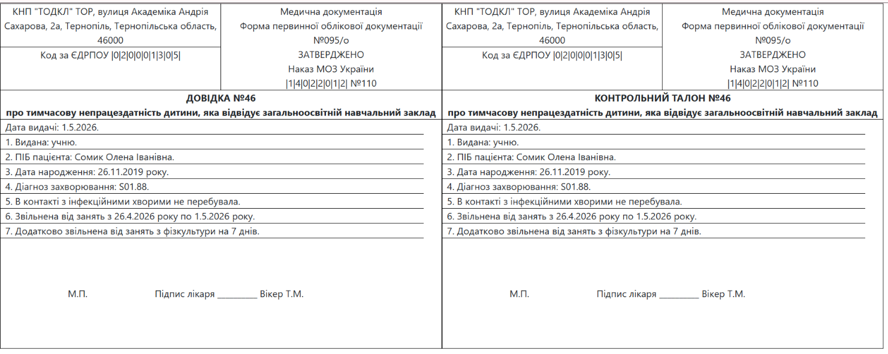

# 🏥 Medical Assistant Tool

A specialized React application designed to streamline the workflow for medical staff in clinical departments. This tool automates the generation of standardized medical documents and provides quick access to diagnostic and intervention codes.

**🔗 [Live Demo (GitHub Pages)](https://olehkuts.github.io/Medical_assistant/)**

---

### 🚀 Key Functionalities

- **Automated Document Generation:** Easily create and print official medical forms:
  - **Lab Referrals:** Generate referral slips with patient data and a list of selected tests.
  - **Educational Certificates:** Create medical excuse notes for students with custom recovery timeframes.
  - **Pre-operative Lists:** Generate daily surgical schedules including patient info and the surgical team.
- **ICD-10 & Intervention Assistant:** A searchable database for finding pathology codes (ICD-10) and related medical interventions, simplifying the coding process for doctors.
- **Local Management:** Customize and save the list of attending physicians in `LocalStorage` for quick selection in documents.

### 📸 Preview


_Example of a generated medical certificate ready for printing._

---

### 🛠 Tech Stack & Implementation

- **Architecture:** Built using **React Class Components**, demonstrating proficiency in the component lifecycle and traditional state management.
- **Routing:** React Router v7.
- **UI/Styling:** Bootstrap & React-Bootstrap for a clean and professional medical interface.
- **Icons:** React-bootstrap-icons.
- **Data Persistence:** Personal settings and physician lists are synchronized with `LocalStorage`.

### 🏗 Technical Note

This project focuses on **Form Handling** and **Data Transformation** within Class Components. It highlights the ability to work with reliable React architectures while maintaining modern standards for navigation and user experience.

---

### ⚙️ Installation

1. Clone the repository:
   ```bash
   git clone https://github.com
   ```
2. Install dependencies:
   ```bash
   npm install
   ```
3. Run the app:
   ```bash
   npm start
   ```
